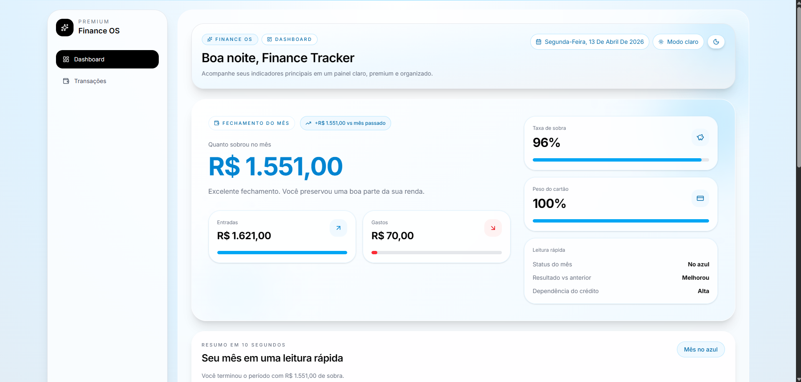
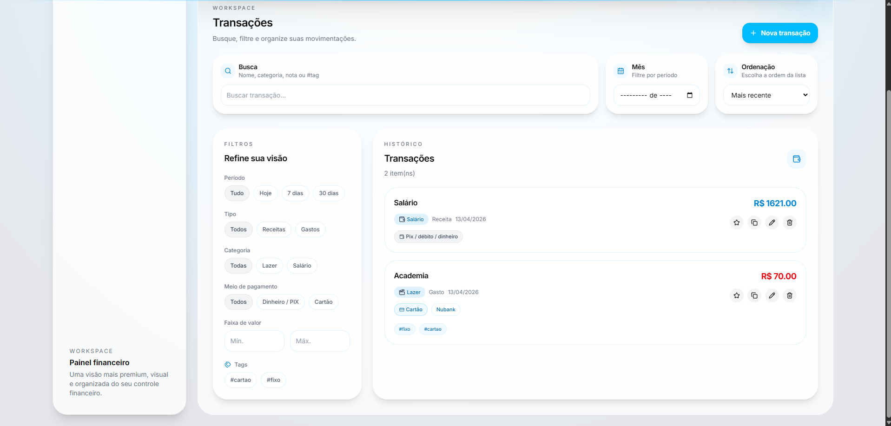

# 💸 PocketView — Personal Finance Tracker

Aplicação de controle financeiro pessoal focada em simplicidade e clareza.

---

## 🧠 Sobre o projeto

O PocketView foi desenvolvido para responder duas perguntas principais:

* Para onde foi meu dinheiro?
* Quanto sobrou no final do mês?

O sistema permite registrar transações manualmente e visualizar os dados de forma clara através de um dashboard moderno.

---

## 🚀 Funcionalidades

* Cadastro de transações (entrada e saída)
* Filtros avançados
* Suporte a cartão de crédito
* Sistema de tags
* Dashboard com visão mensal
* Comparação com mês anterior
* Interface moderna estilo SaaS

---

## 🛠️ Tecnologias

### Frontend

* Next.js
* TypeScript
* TailwindCSS
* Framer Motion

### Backend

* Node.js
* Express
* SQLite

---

## 📁 Estrutura

```
PocketView/
  ├── frontend/
  ├── backend/
```

---

## 📸 Preview




## 🌐 Live Demo

👉  https://pocket-view.vercel.app/

---

## ▶️ Como rodar localmente

### Frontend

```
cd frontend
npm install
npm run dev
```

### Backend

```
cd backend
npm install
npm start
```

---

## 📌 Objetivo

Projeto desenvolvido para prática de:

* Desenvolvimento fullstack
* Criação de interfaces modernas
* Estruturação de produto

---

## 👨‍💻 Autor

Wesley Marques
